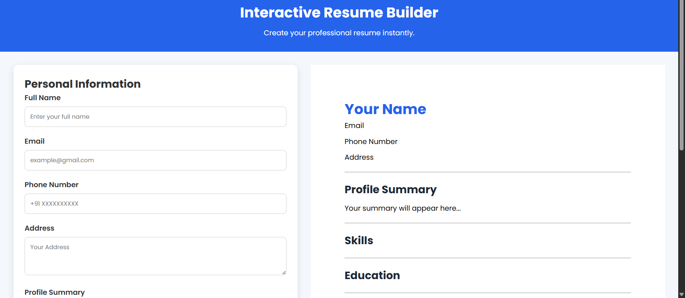
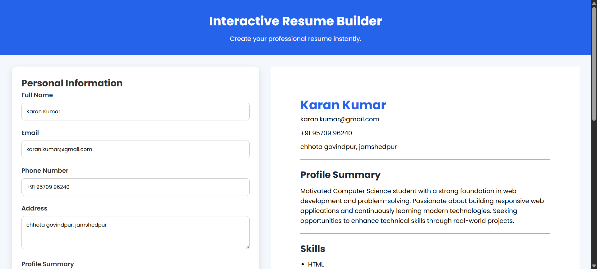
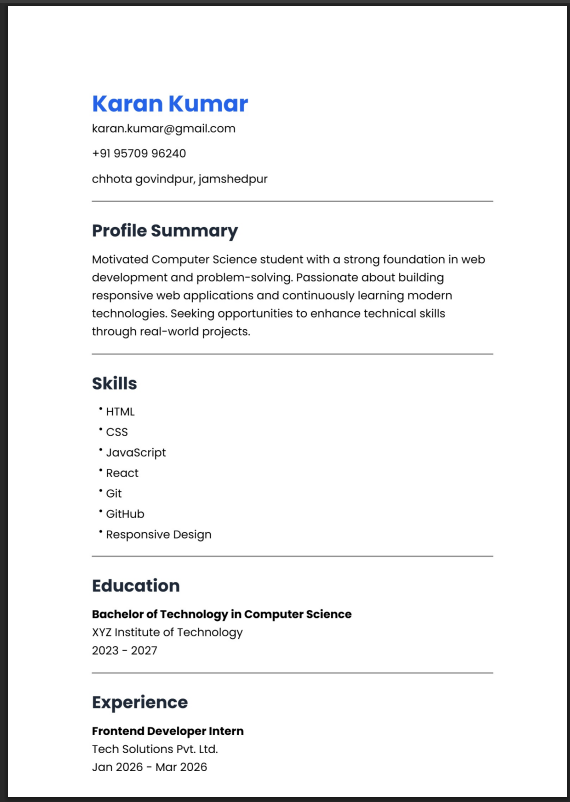

# 📄 Interactive Resume Builder

An interactive and responsive **Resume Builder** built using **HTML, CSS, and JavaScript**.

This project allows users to enter their personal information, skills, education, and experience while instantly previewing the resume. Users can also export the generated resume as a PDF.

---

## 🌐 Live Demo

👉 https://kaushalvivek2005.github.io/interactive-resume-builder/

---

## 📸 Screenshots


### Home Page



### Live Resume Preview



### Generated PDF



---

## ✨ Features

- Live Resume Preview
- Personal Information Form
- Dynamic Education Section
- Dynamic Experience Section
- Skills Preview
- Clear Form
- Download Resume as PDF
- Responsive Design
- Smooth CSS Animations & Transitions

---

## 🛠️ Technologies Used

- HTML5
- CSS3
- JavaScript (ES6)
- html2pdf.js

---

## 📁 Project Structure

```text
Interactive-Resume-Builder/
│
├── index.html
├── style.css
├── script.js
├── README.md
└── screenshots/
```

---

## 🚀 Getting Started

### Clone the Repository

```bash
git clone https://github.com/kaushalvivek2005/interactive-resume-builder.git
```

### Run the Project

Simply open **index.html** in any modern web browser.

No installation or dependencies are required.

---

## 📖 How to Use

1. Enter your personal information.
2. Add your skills.
3. Add multiple education details.
4. Add multiple experience details.
5. Preview updates instantly.
6. Click **Download PDF** to save the resume.

---

## ⚙️ Functionalities

### 👤 Personal Information

- Full Name
- Email
- Phone Number
- Address
- Profile Summary

### 💻 Skills

- Add multiple skills separated by commas.
- Skills appear instantly in the live preview.

### 🎓 Education

- Add multiple education entries.
- Degree
- College Name
- Passing Year

### 💼 Experience

- Add multiple experience entries.
- Job Title
- Company Name
- Duration

### 👀 Live Preview

Resume updates automatically while typing.

### 🗑️ Clear Form

Resets the complete form and preview.

### 📄 Download PDF

Exports the generated resume as a PDF.

---

## 🚀 Future Improvements

- Profile Picture Upload
- Dark Mode
- Local Storage Support
- Edit & Remove Education/Experience
- Multiple Resume Templates
- Theme Selection
- Drag & Drop Resume Sections

---

## 👨‍💻 Author

**Kaushal Kumar**

- 🎓 B.Tech in Information Technology
- 🏫 BIT Sindri

